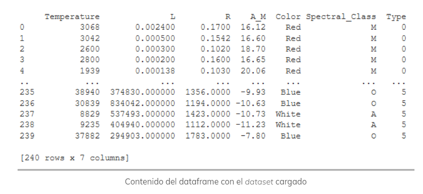
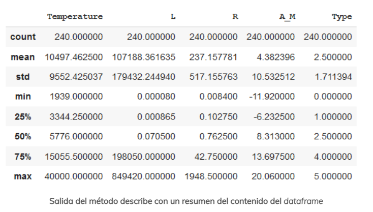
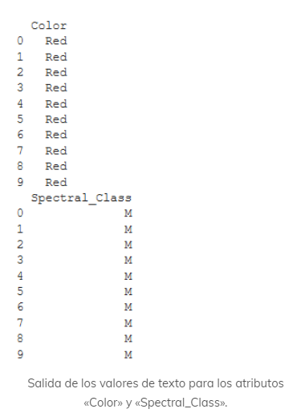

### Preprocesamiento de datasets con Python, Scikit-learn y Pandas

Link [Page](https://aprendeconejemplos.org/python/preprocesamiento-de-datasets-con-scikit-learn-y-pandas)

Serie de técnicas de preprocesamiento de datasets con Python, Scikit-learn y Pandas. Estos métodos se usan cuando queremos preparar un dataset para aplicar un algoritmo de aprendizaje automático.

1. Obtenemos un Data Set no procesado.
Usaremos un data set de clasificación de estrellas 
[Dataset](https://www.kaggle.com/brsdincer/star-type-classification/download)

### Cosas comunes que nos podemos encontrar:

Podemos esperar encontrarnos cualquier cosa dentro del mismo. Así, es frecuente encontrar caracteres extraños o no imprimibles, algunos datos que nos faltan, etc.

El dataset seleccionado viene en formato de valores separados por comas (Comma-separated values)

### 1. Lectura del data set con Pandas

```Python
import pandas as pd
import sklearn as skl

url = "https://raw.githubusercontent.com/AprendeConEjemplos/aprendizaje-automatico-con-scikit-learn/main/04_Preprocesamiento/Stars.csv"
dataframe = pd.read_csv(url)
print(dataframe)
```

Como vemos en las dos primeras líneas cargamos las librerías Pandas y Scikit-learn y les ponemos un alias más corto (pd y skl respectivamente)

Output:


### 2. Un primer acercamiento al contenido del dataset

Ahora que tenemos cargado el dataset dentro de un dataframe, podemos empezar a usar la gran cantidad de funcionalidad de la librería Pandas. Algo bastante útil es usar el método «describe» del dataframe que nos indica un resumen del contenido del mismo. 

```python
print(dataframe.describe())
```
output:


+ ount: Indica la suma de los valores no nulos de cada atributo. Los valores nulos/no presentes no suman.
+ mean: Valor medio de ese atributo.
+ std: Desviación estándar de los valores de ese atributo.
min: Valor mínimo del atributo.
+ 25%, 50%, 75%: Se corresponde con los valores correspondientes con esos percentiles. Así, las instancias que están dentro del percentil más bajo tienen una temperatura menor de 3344.25 grados.
+ max: Valor máximo para el atributo.

### 3. Iniciando el preprocesamiento 

Lo primero que vamos a realizar, es separar los atributos de las instancias del dataset de la etiqueta que queremos usar para el entrenamiento. 

```python
dataset = dataframe.drop("Type", axis=1)
label = dataframe["Type"].copy()
```

Como vemos la primera línea usa la función `drop` que elimina una línea o columna de la tabla especificando una etiqueta y un eje. En nuestro caso eliminamos la columna (axis=1) que se etiqueta como «Type», y el resultado se asigna a la variable dataset.

Luego seleccionamos la columna `Type` y la copiamos en la variable labels. La forma de seleccionar las columnas de un dataframe es similar a como se selecciona un valor de un diccionario de `python`, usando como key el nombre de la columna.

### 4. Limpiando el Dataset

La mayoría de los problemas surgen cuando las instancias tienen atributos con datos nulos. Es decir, si en nuestro dataset tenemos un atributo para el que algunas instancias tienen un valor pero otras no.

### 4.1 Ejemplo de limpieza de datasets

Imaginemos que el atributo `Temperature` tuviera valores nulos para algunas instancias.

```python
dataframe_op1 = dataframe.dropna(subset=["Temperature"])    # Opción 1, eliminamos las instancias con valores nulos
dataframe_op2 = dataframe.drop("Temperature", axis=1)       # Opción 2, eliminamos el atributo que contiene valores nulos
mean_temp = dataframe["Temperature"].mean()
dataframe_op3 = dataframe["Temperature"].fillna(mean_temp)  # Opción 3, asignamos el valor medio en los valores nulos
```

El primer caso elimina los valroes nulos. Usamos el parámetros `subset` para indiciar la columna que peude contener valores nulos. 

En el segundo caso usamos el método `drop` indicando que queremos eliminar todos los valores del eje1 (valores en la columna). 

Caso 3: Calculamos el valor medio `mean` para la columna `Temparature`. Mediante el método `fillna` rellenamos los valores nulos de la columna `Temperature` con el valor medio.

### 5. Preprocesando atributos con texto en el dataset

En general los algoritmos de `machine leargning` no trabajan con atributos con valores que no sean numéricos.

Tenemos dos `Color` que nos indica el color de la estrella en inglés. Y `Spectral_Class` que es otro atributo categórico (M, O, A). 

### 5.1 Selecionando los atributos con texto

```python
color_cat = dataframe[['Color']]
spectral_cat = dataframe[['Spectral_Class']]
print(color_cat.head(10))
print(spectral_cat.head(10))
```
En este código seleccionamos los valores de los atributos.

output:


### 5.2 Pasando los atributos de texto a número

La primera opción es hacer una trasformación directa a cada valor del atributo de texto a un número correlativo. Es decir, si tenemos los valores `A, B, C` pasar los mismos valores a valor numérico `0, 1, 2`

Para realizar esta conersión podemos utilizar las herramientos de preprocesamiento que nos brinda `Scikit-learn`.

```python
from sklearn.preprocessing import OrdinalEncoder
ordinal_encoder = OrdinalEncoder()
color_cat_encoded = ordinal_encoder.fit_transform(color_cat)
print(color_cat_encoded[:10])
```

En este código importamos el codificador `OrdinalEncoder`. Posteriormete creamos un objeto de tipo `OrdinalEncoder` y mediante el método `fit_transform` obtenemos la trasnformación de los valores de texto a un valor numérico.

Esto tiene algo interesante. La mayor parte de algoritmos de aprendizaje van a asumir que los valroes cercanos van a ser similares. Esto puede estar bien para atributos con valores como `Mal` `Regular` `Bien` `Excelente`. Pero en nuestro caso y con los colores no tiene que ser buena idea por eso utilizaremos otra forma de codificación.

### 5.3 Codificando atributos de texto con One Hot Encoding

Lo que hacemos es crear un atributo con vlaores binarios para cada valor de texto por ejemplo

En el atributo COLOR tenemos el valor `RED`. Así creamos un atributo binario de nombre `RED` siendo 1 para instancias cuyo valor sea `RED` y 0 en otro caso. 

```python
from sklearn.preprocessing import OneHotEncoder
one_hot_encoder = OneHotEncoder()
color_cat_one_hot = one_hot_encoder.fit_transform(color_cat)
print(color_cat_one_hot.toarray().shape)
print(color_cat_one_hot.toarray())
```

output:
```python
(240, 17) 
[[0. 0. 0. ... 0. 0. 0.]  
 [0. 0. 0. ... 0. 0. 0.] 
 [0. 0. 0. ... 0. 0. 0.] 
 ... 
 [0. 0. 0. ... 0. 0. 0.] 
 [0. 0. 0. ... 0. 0. 0.] 
 [1. 0. 0. ... 0. 0. 0.]]
 ```

 Se usaría en caso de que tenemos un gran número de valores de texto generaremos un número igual de atributos binarios. Esto puede provocar que el algoritmo de machine learning se resienta y el desempeño sea peor. Tiempos largos de entramiento, inferencia, etc.

 En este caso es mejor cambiar estos valores de texto por un atributo numérico que sea apropiedo en el caso de los colores podríamos utilizar un modelo de colores.

 ### 5.4 Escalado de atributos

 Esta es una tarea fundmaental. Ya que los principales algoritmos de machine leargning no funciona muy bien cuando existen una gran diferencia entre los valores de un atributo. En el caso del data set, gemos comprobado que tenemos algunos atributos como ejemplo `L` que tiene valores muy distantes (0-849820). Esto es algo que debemos evitar, ya que los algoritmos de aprendizaje no funcionan bien en estos casos.

 Existen dos formas para solucionar estos problemas de escalas:
 `Normalización de valores` y la `estandarización`

 ### 6. Normalización de valores de un atributo

 El escalado min-max o normalización. Tiene como objetivo que todos los valores de un atributo estén comprendidos en el intérvalo [0-1] de forma matemática lo que estamos haciendo es a cada valor le restamos el mínimo y lo dividimos entre el valor máximo.

 Scikit-learn contienen funcionalidades para obtener el valor normalizado de un atributo numérico.

 ```python
from sklearn.preprocessing import MinMaxScaler

min_max_scaler = MinMaxScaler()
l_values = dataframe[['L']]
scaled_values = min_max_scaler.fit(l_values)
print(min_max_scaler.transform(l_values)[0:10])
 ```

Importamos el algoritmo para escalar valores de un atributo. Luego creamos el objeto de tipo `MinMaxScaler`. Obtenemos los valores del atributo `L` que queremos escalar. Usamos el método `fit` para obtener el mínimo y el máximo que se usarán. Posteriormente el método `transform` para obtener los valores del atributo. La última línea muestra los diez primero valores escalados.

```python
[[2.73127546e-09] 
 [4.94455040e-10] 
 [2.59000259e-10] 
 [1.41272869e-10] 
 [6.82818865e-11] 
 [6.71046126e-10] 
 [7.65228038e-10] 
 [3.76727649e-10] 
 [7.18137082e-10] 
 [1.17727390e-10]]
```

### 7. Estandarización de valores de un atributo

Restamos la media de los valores y dividimos por la desviación estándar de los mismos. De esta forma los valroes obtenidos tendrán una media de cero y una varianza de uno.

Diferencias con respecto a la normalización:
1. No están acotados en ningún rango ([0-1])
2. Este método consigue solucionar el problema de valores atípicos u outliers que presenta la normalización. 

```python
from sklearn.preprocessing import StandardScaler

standard_scaler = StandardScaler()
l_values = dataframe[['L']]
scaled_values = standard_scaler.fit(l_values)
print(standard_scaler.transform(l_values)[0:10])
```

output:
```python
[[-0.59862356] 
 [-0.59862357] 
 [-0.59862357] 
 [-0.59862357] 
 [-0.59862357] 
 [-0.59862357] 
 [-0.59862357] 
 [-0.59862357] 
 [-0.59862357] 
 [-0.59862357]]
 ```

 ### 8. Automatización de los pasos de preprocesamiento de datasets con Scikit-learn

 Aplicar los pasos previamente vistos de forma manual puede resultar engorroso y con tenedencia a cometer fallos.

 La libería Scikit-learn brinda la funcionalidad de automatizar el proceso de preprocesamiento de dataset. 

 `Tuberías de proesamiento (transformation pipelines)`

 Debemos pensar en estas tuberías como en una lista de tareas que se ejecutan de forma secuencial sobre un atributo. 

 Tendríamos que aplicar pipelines a cada atributo de forma secuencial. Para solucionar esto la libería presenta un transformador de columnas especialmente diseñada para trabajar con datos en forma de tabla. Como los datagrames de pandas.

 ### Ejemplo:

 ```python
 from sklearn.compose import ColumnTransformer
num_attrs = ["Temperature", "L", "R"]
text_attrs = ["Color", "Spectral_Class"]

pipeline = ColumnTransformer([
                              ("numeric", StandardScaler(), num_attrs),
                              ("text", OneHotEncoder(), text_attrs)
])
preprocessed_dataset = pipeline.fit_transform(dataset)
 ```
Definimos los nombres de los atributos sobre los que vamos a realizar las diferentes tareas de preprocesado. En nuestro caso, vamos a separar atributos de texto a los que les aplicaremos el `OneHotEncoder` y los atributos numéricos a los que le realizaremos un proceso de estandarización. 

Posteriormente definimos el objeto de tipo `ColumnTransformer` usando uan lsita en la que cada item contiene un nombre, el proceso que queremos aplicar y los atributos sobre los que va a actuar.
Así el primer `item` sería (numeric, StandarScaler(), num_attrs) siendo el nombre `numeric` el que queremos indicarle, `StandarScaler` la estandarización y `num_attrs` una lista de nombres de los atributos numéricos.

Finalmente en la variable `preprocessed_dataset` obtenemos el dataset preprocesado que será una `matriz dispersa`. Este objeto puede ser usado directamente con los algoritmos de machine learning.

